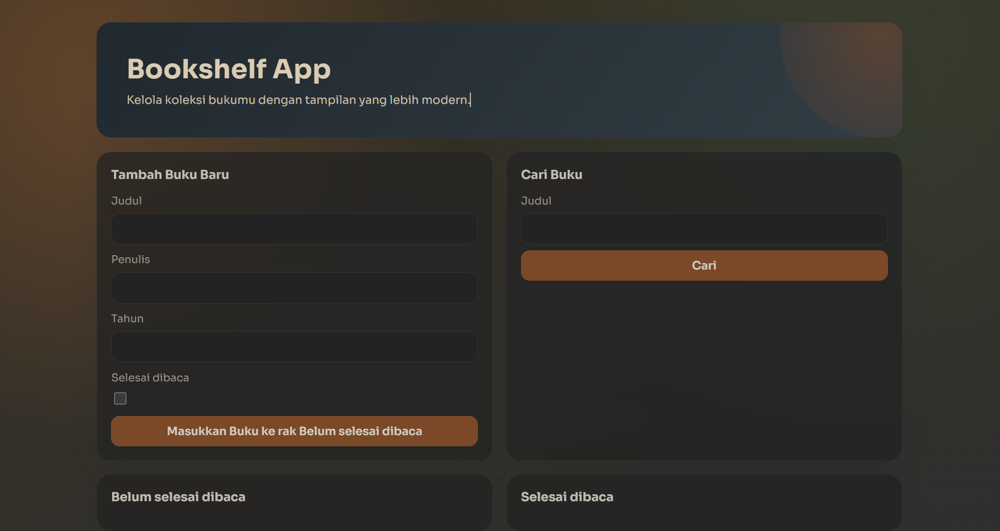

# Bookshelf Management REST API

This project is a RESTful API implementation for a Bookshelf management system built using Node.js and Hapi. The repository also includes a simple frontend interface and Postman testing assets.

## Directory Structure

```text
BOOKSHELF-RESTFULAPI/
├── bookshelf-api/                           # Main application directory
│   ├── src/                                 # Backend API source code
│   ├── frontend/                            # User Interface (UI)
│   │   ├── images/                          # Documentation image assets
│   │   ├── index.html
│   │   ├── main.js
│   │   └── styles.css
│   └── package.json                         # Project dependencies configuration
├── BookshelfAPITestCollectionAndEnvironment/ # Postman collection & environment
└── README.md
```

## Running the Application

### 1. Backend API
Open your terminal or Command Prompt (CMD) and run the following commands sequentially from the root folder:

```bash
# Navigate to the application directory
cd bookshelf-api

# Install dependencies
npm install

# Start the server
npm run start
```

### 2. Frontend Interface
Navigate to the `bookshelf-api/frontend` folder. You can open the `index.html` file directly in your browser or use the **Live Server** extension in VS Code. 

Here is a preview of the frontend dashboard:



## API Testing

All API testing scenarios have been prepared using Postman. 
1. Open the `BookshelfAPITestCollectionAndEnvironment` folder.
2. Import both the *Collection* and *Environment* files into your Postman workspace.
3. Run the available requests to verify the CRUD (Create, Read, Update, Delete) functionality.

Here is a preview of the Postman test results:

